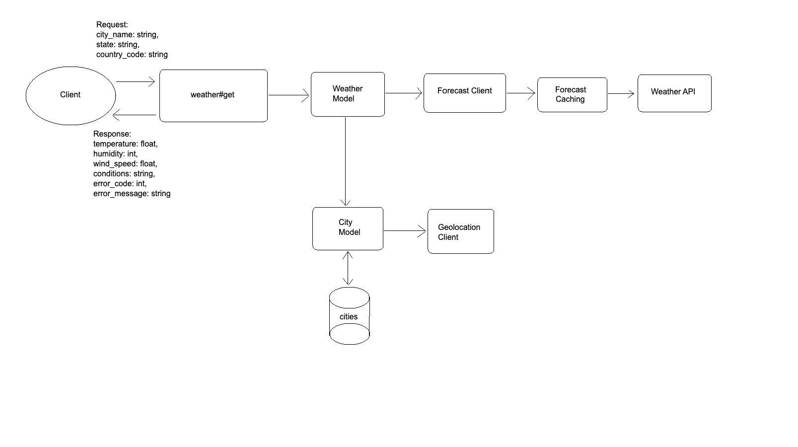

# README

### Getting Started

**Pre-requisites:**

* Have docker installed on your machine and have the ability to run docker-compose

**Setup:**

* Clone the repository
* CD into the directory
* Add your OpenWeather API key to the .env file in `olive/rails/weather-api/.env`. One should be provided in an email to
  contributors or you can sign up for an account at [OpenWeather](https://openweathermap.org/api)
  * `OPEN_WEATHER_API_KEY=your_api_key`
* Run `docker compose up` and wait for the containers to build
* JSON responses are served at `localhost:3000/weather`
  * `curl -XGET 'localhost:3000/weather?city_name=Arlington&state=Virginia&country_code=US'`

**Testing:**

* Exec into a running container with `docker exec -it weather-api sh`
* Run `bundle exec rspec` to run the entire test suite or `bundle exec rspec filepath` to run a specific test file

***
### Architecture

The application has one endpoint `/weather` that takes in a city name, state, and country code. The endpoint will
return a JSON response with either the current weather for the city or an error object with a message and status.

I wanted to allow consumers to search by city name, but weather services like OpenWeather require latitude and longitude.
I think this is unreasonable for most users to know, so I compromised by allowing lookup by city name, state, and country
code with a layer in-between to lookup city coordinates. The advantage of this is that the product is more user friendly.
A drawback is that we need to lookup city coordinates each time a request is made. I've tried to mitigate this by writing
city coordinates to the database after the first time they are looked up and including a composite index on the city name,
state, and country code to speed up future reads.

A large drawback of looking up city coordinates is the we are at the mercy of the coordinate lookup service to provide 
a response that makes sense and we have little recourse if it doesn't. If the service provides a nonsensical response, 
it is difficult to programmatically determine it's accuracy. There is room for improvement here. The best approach would 
probably be for a front-end client to be responsible for providing coordinates based on user input and we could skip 
this step entirely.

When a weather request is made, we either retrieve the city coordinates from the DB or make an API request to find them
before storing them in the DB. Then, we use the coordinates to make a request to the weather service provider. The request
to the provider is wrapped in a cache layer that will store the response in Redis for 10 minutes. 10 minutes is the suggested
time by OpenWeather but can be adjusted according to business needs.

The cache data is stored with a key that references the city database object (ie, `"#{city_object}_weather"`). This allows us
to take advantage of a few things:
* Updating the database object essentially invalidates the cache
  * We technically don't remove the data, but Redis will automatically evict unused data if it needs to make room
* We can easily lookup the cache data by city object

If an error is returned from the weather provider, we raise a related exception which is later rescued and used to build
an error response object. We get some extra flexibility here by abstracting the error handling away from the weather service
providers and can build a more consistent response object.

I've only implemented an OpenWeather API client for the weather service but have built in such a way that in the future
it could be easily swapped to another weather service provider. Clients (`rails/weather-api/app/clients`) are responsible for making API requests and then
the responses are passed through a translation layer to convert into a common response object. The advantage here is that
we abstract away some of the implementation details of the specific providers and can build a more extensible and flexible 
system.

#### The Weather Response Object

Weather data returned by APIs includes an enormous amount of data. For this project, I've chosen to only work with current
weather data and build with an eye towards future extensibility. If I wanted to add hourly, daily, or other weather data,
my initial thoughts would be:

* Seperate weather requests by type (current, hourly, daily, etc)
  * Could be seperate endpoints or just as an additional query param
* Cache data by type
  * `"#{city_object}_weather_#{type}"`
  * Different types of data may potentially require different expiration times -- would need to dive in more to determine
    what makes sense

***

### Future Improvements

* Allow weather lookup by latitude and longitude
* Add layer between weather / city models to dynamically instantiate clients instead of directly calling them
* Add additional weather options. Currently, only current weather is supported.
* Redis scales to 250+ million keys so we would run into memory issues before before Redis limitations. 
* Storing values in hashes is the most memory efficient way to store data in Redis but its possible we could run into maximum
  memory limits at some point. As it stands, this would result in use evicting old data to make room for new data but that
  would lead to reduced performance at large scale. For a large application, we are probably limited more by cost than
  space as AWS offers cache sizes up to 400GB--probably enough to store weather data for most cities in the world over the
  eviction period.

***
### Product Questions

* Requirements are to search for weather and cache weather by city name, but cities in different states can have the
  same name. Can we ask for additional location information like a state or zip code? Is there any projected
  international use case? If so, we would also need to consider that asking for a country code or that other countries
  don't necessarily have states / zip codes in the same way that the US does.
    * For this exercise, I'm forcing users to include a state and country code.
